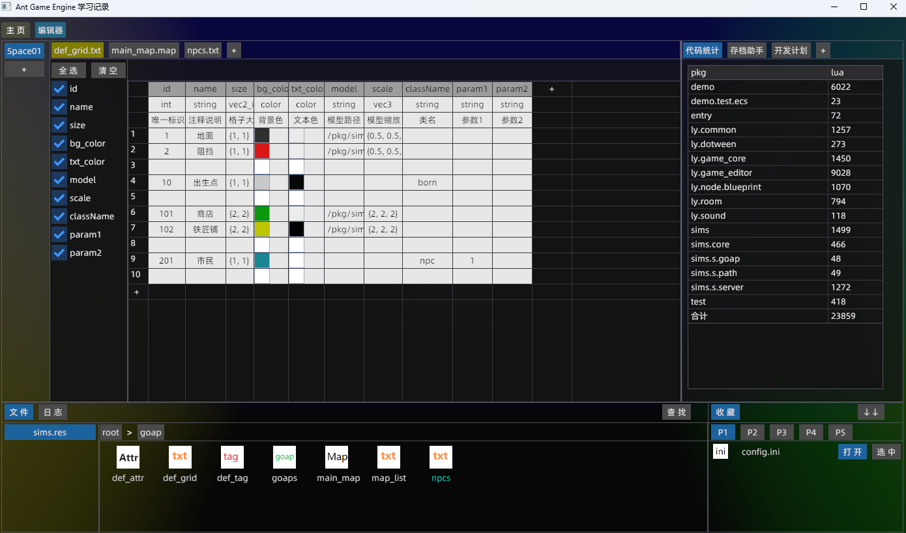
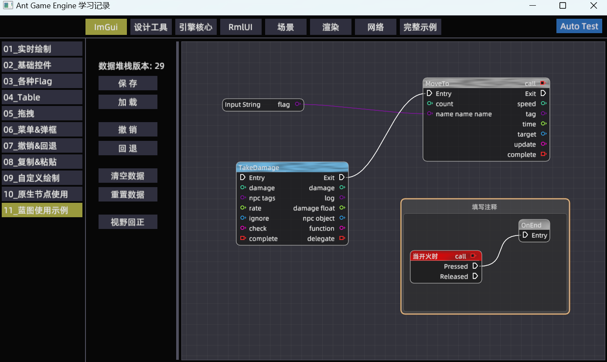
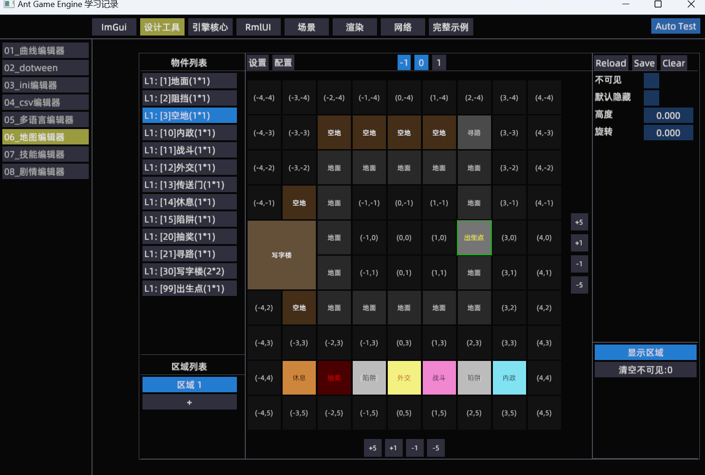
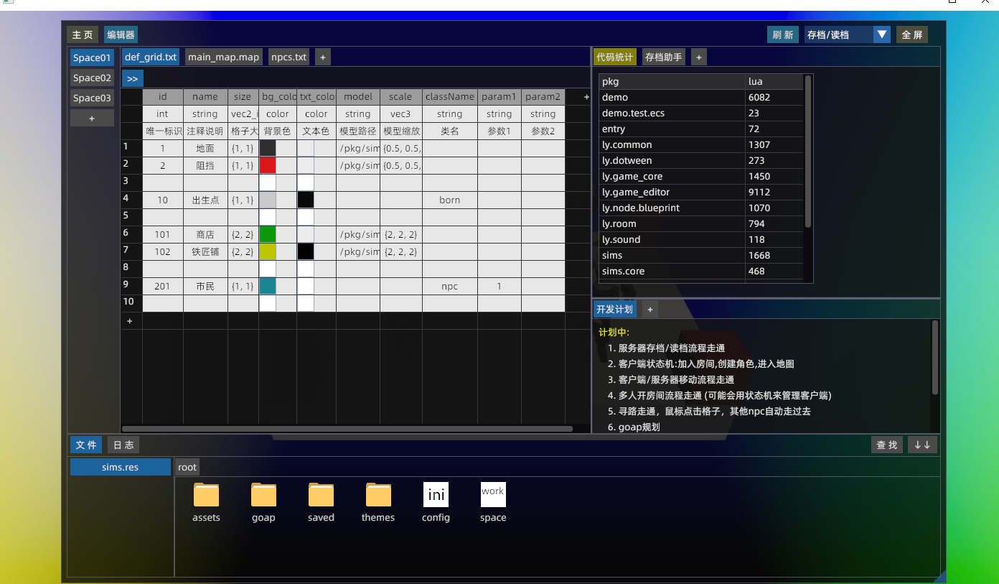

# Ant Game Engine 学习记录
学习使用[Ant Game Engine](https://github.com/ejoy/ant)，目前有两个入口:  
（注，本人平时要上班，以下工作都在业余时间进行，可能进度会比较慢，欢迎有相同意向的加入）
## 入口1: demo场景 
主要用于演示引擎基础功能，指导方针如下：
* 尽可能给每一个功能点都加上示例代码
* 尽可能覆盖游戏开发的方方面面，比如编辑器，UI，渲染，联机，调试，优化，资源管理，对接Steam等等
* 尽量封装+模块化，以便需要时直接Ctrl+C, Ctrl+V
* 如下图所示，程序会尽可能罗列出每个功能使用示例


## 入口2：smis场景
准备做一个支持局域网联机的小demo，试图打造一套基于运行时的工具链：
* 所有模块都支持热重载，追求极致工作效率
* 统一研发人员与mod开发者的工作流，大家一视同仁，都用一样的工具
* 如下图所示，左边为游戏编辑器，右边为游戏场景。左边修改后，点击刷新右边立刻重新加载


## 如何运行
```
-- clone引擎，注意: 就用默认名字ant
git clone https://github.com/ejoy/ant.git   

-- clone项目, 注意: 需与引擎处在同级目录
git clone https://github.com/constly/ant_demo.git

cd ant_demo
run_build.bat
run.bat 

-- 双击 ant_demo.code-workspace 打开vscode
```

## 工具链相关
### 一. 客户端多开
1. 运行文件服务器: "./bin/msvc/debug/ant_demo.exe" -s
2. 启动运行时版本: "./bin/msvc/debug/ant_demo.exe" -rt
3. 日志输出在: startup/.app/log/runtime-1.log

### 二. 调试C++
1. 用Visual Studio打开项目根目录
2. 将bin/msvc/debug/ant_demo.exe设置为启动项, 启动即可调试C++

### 三. 关于编译
1. 某些情况下会报奇怪的编译报错，这时可以看文件中是否有中文，改下文件的编码或者把中文删掉试试

### 四. 使用的插件
1. 声音使用的 [cute](https://github.com/RandyGaul/cute_headers)
2. 节点编辑器使用的 [imgui-node-editor](https://github.com/thedmd/imgui-node-editor.git)
2. lua语法提示使用的 [EmmyLua](https://github.com/EmmyLua/IntelliJ-EmmyLua)

### 五. 安装特效编辑器Effekseer  
1. 官方文档 [HowToBuild](https://github.com/effekseer/Effekseer/blob/master/docs/Development/HowToBuild.md)  
2. 另外需要安装python最新版,以及执行: pip install setuptools
3. Effekseer/ResourceData/samples目录下有大量示例

### 六. bgfx学习
1. 如何 [build](https://github.com/bkaradzic/bgfx/blob/master/docs/build.rst)
2. bgfx下有大量使用示例, 网上也有 [学习笔记](https://hinageshi01.github.io/2022/05/30/bgfx/)

### 七. 打包
1. 执行run_pack.bat，相关文件会发布到publish/下
2. 目前只考虑了windows平台
3. 点击publish/run.bat启动游戏

## deom场景部分内容展示






## sims场景部分内容展示
玩法编辑器支持任意分屏和dock



## 待解决问题
1. 如何遍历场景中所有entity, 以及他们身上有什么组件, 并且展示出组件属性字段
2. 建议：引擎相关类定义时能否加上 ---@class 标识， 这样方便代码跳转
3. 自走棋多world如何实现
4. 海量人群渲染，包括各自播放不同的动作 （参考laya的例子）
5. 地图编辑器是否有必要： 某些物件只能放置在某些层级？
6. 在PC平台时，需要捕获窗口关闭事件，以便释放声音资源
7. 拖动PC窗口时，能否不要暂停游戏，这会导致声音出现嘶嘶嘶的问题，也会暂停windows的收发包
8. windows平台希望有接口得到窗口句柄，声音需要
9. 互相require对方时，程序会死循环，无响应，希望能有友好的提示输出

