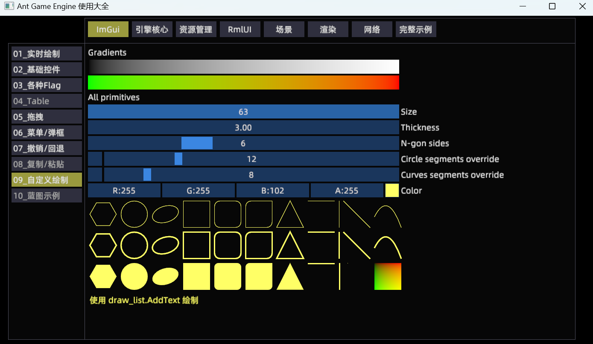

# Ant Game Engine 使用大全
本项目试图帮助广大开发者尽快上手[Ant Game Engine](https://github.com/ejoy/ant)，具体指导方针如下:
* 尽可能给每一个功能点都加上示例代码
* 尽可能覆盖游戏开发的方方面面，比如编辑器，UI，渲染，联机，调试，优化，资源管理，对接Steam等等
* 尽可能多写注释讲明原理
* 尽量封装+模块化，以便需要时直接Ctrl+C, Ctrl+V


**欢迎有兴趣的朋友加入进来一起完善，部分界面如下:**




#### 所有示例如下 （划线的表示尚未开始）
* ImGui - 01_实时绘制
* ImGui - 02_基础控件
* ImGui - 03_各种Flag(50%)
* ~~ImGui - 04_Table~~
* ImGui - 06_菜单/弹框
* ImGui - 07_撤销/回退
* ~~ImGui - 08_复制/粘贴~~
* ImGui - 09_自定义绘制
* ~~ImGui - 10_蓝图示例~~
* ~~引擎核心 - 01_entity~~
* ~~引擎核心 - 02_system~~
* ~~引擎核心 - 03_pipeline~~
* ~~引擎核心 - 04_itask~~
* ~~资源管理 - 01_通过vfs加载资源~~
* ~~资源管理 - 02_自定义文件读取~~
* ~~RmlUI - 01_基础控件~~
* ~~RmlUI - 02_列表和弹框~~
* ~~RmlUI - 03_UI播放动画~~
* ~~RmlUI - 04_UI播放特效~~
* ~~RmlUI - 05_UI中显示RT~~
* ~~渲染 - 01_LOD~~
* ~~渲染 - 02_光影/迷雾~~
* ~~渲染 - 03_森林/草原~~
* ~~渲染 - 04_河流/瀑布~~
* ~~渲染 - 05_下雪和脚印~~
* ~~渲染 - 06_下雨和水面涟漪~~
* ~~渲染 - 07_RenderTexture~~
* ~~渲染 - 08_卡通渲染~~
* ~~渲染 - 09_画质设置~~
* 其他若干示例待规划


## 如何运行
将工程克隆到引擎根目录，然后执行run.bat，注意: 默认使用release引擎
```
git clone https://github.com/constly/ant_demo.git
cd ant_demo
run.bat 
```


## 如何注册一个功能示例
```
local ecs = ...
local mgr = require "data_mgr"
local tbParam = 
{
    ecs             = ecs,
    system_name     = "系统名字",           -- 如: imgui_02_system
    category        = "用例所属类别",       -- 如: mgr.type_imgui
    name            = "用例名字",           -- 如: 01_ImGui基础功能展示
    desc            = "用例描述",           -- 如: 展示ImGui常用控件
    file            = "用例文件路径",       -- 如: imgui/imgui_02.lua
    ok              = false,               -- 功能是否已经开发完成
}
local system = mgr.create_system(tbParam)

-- 当进入示例时（可能需要执行一些初始化）
function system.on_entry()
end

-- 当离开示例时（可能需要执行清理操作）
function system.on_leave()
end

-- 每帧更新
function system.data_changed()
    -- 具体示例代码写这里
end
```