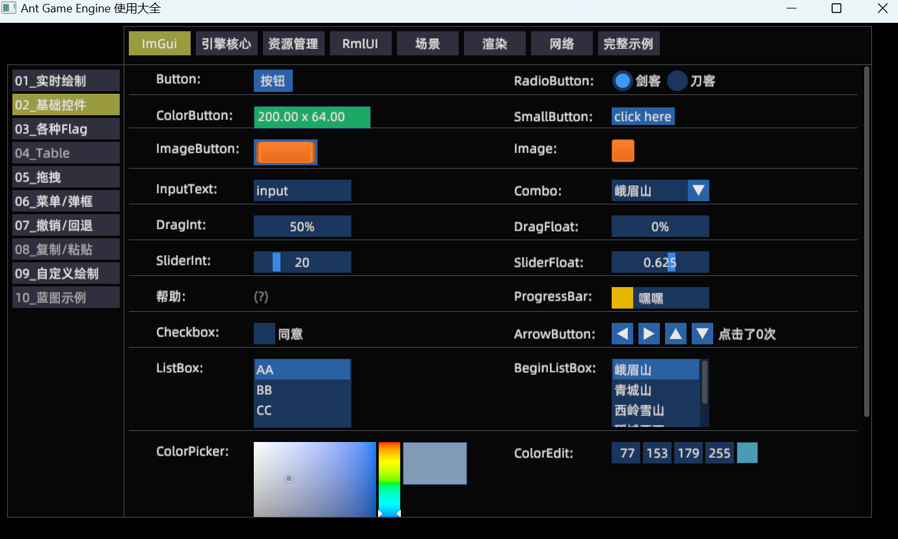
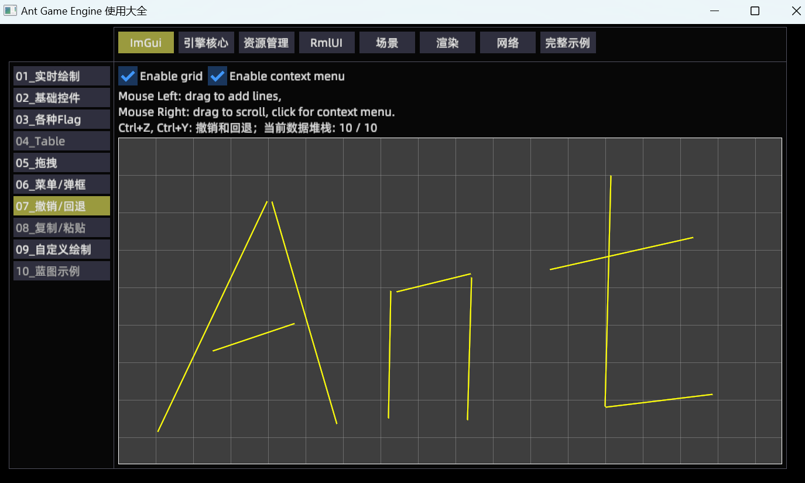
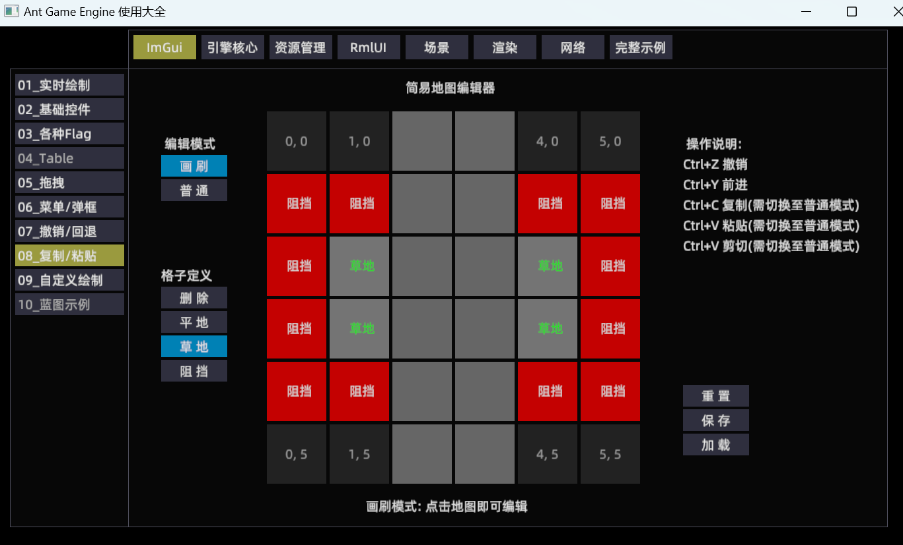
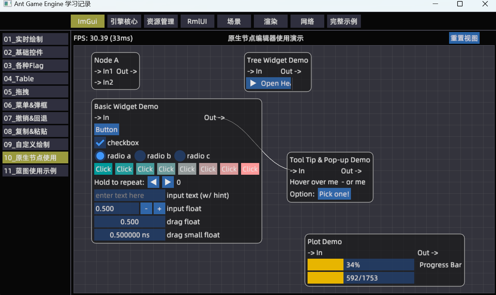
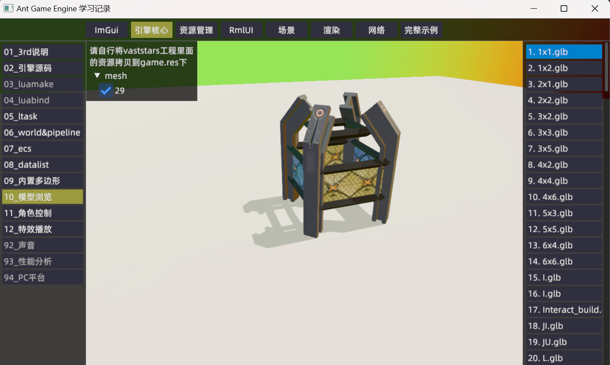
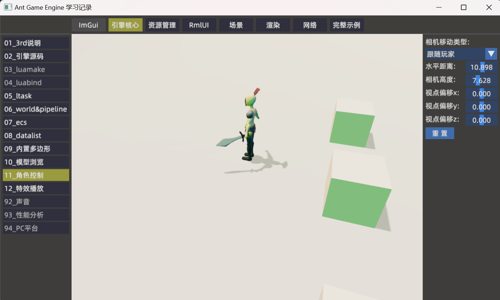

# Ant Game Engine 学习记录
学习使用[Ant Game Engine](https://github.com/ejoy/ant)，指导方针如下：
* 尽可能给每一个功能点都加上示例代码
* 尽可能覆盖游戏开发的方方面面，比如编辑器，UI，渲染，联机，调试，优化，资源管理，对接Steam等等
* 尽量封装+模块化，以便需要时直接Ctrl+C, Ctrl+V


## 如何运行
```
-- clone引擎，注意: 就用默认名字ant
git clone https://github.com/ejoy/ant.git   

-- clone项目, 注意: 需与引擎处在同级目录
git clone https://github.com/constly/ant_demo.git

cd ant_demo
compile.bat
run.bat 

-- 双击 ant_demo.code-workspace 打开vscode
```

## 工具链相关
### 一. 如何多开
1. 运行文件服务器: "./bin/msvc/debug/ant_demo.exe" -s
2. 启动运行时版本: "./bin/msvc/debug/ant_demo_rt.exe"
3. 运行时版本可以多开
4. 日志输出在: startup/.app/log/runtime-1.log

### 二. 如何调试
1. 用Visual Studio打开项目根目录
2. 将bin/msvc/debug/ant_demo.exe设置为启动项, 启动即可调试C++
3. 运行时版本 ant_demo_rt.exe 也可以用同样的方式调试

### 三. 使用的插件
1. 声音使用的 [cute](https://github.com/RandyGaul/cute_headers)
2. 节点编辑器使用的 [imgui-node-editor](https://github.com/thedmd/imgui-node-editor.git)
2. lua语法提示使用的 [EmmyLua](https://github.com/EmmyLua/IntelliJ-EmmyLua)

### 四. 安装特效编辑器Effekseer  
1. 官方文档 [HowToBuild](https://github.com/effekseer/Effekseer/blob/master/docs/Development/HowToBuild.md)  
2. 另外需要安装python最新版,以及执行: pip install setuptools
3. Effekseer/ResourceData/samples目录下有大量示例

### 五. bgfx学习
1. 如何 [build](https://github.com/bkaradzic/bgfx/blob/master/docs/build.rst)
1. bgfx下有大量使用示例, 网上也有 [学习笔记](https://hinageshi01.github.io/2022/05/30/bgfx/)


## 内容展示








## 待解决问题
3. 如何遍历场景中所有entity, 以及他们身上有什么组件, 并且展示出组件属性字段
