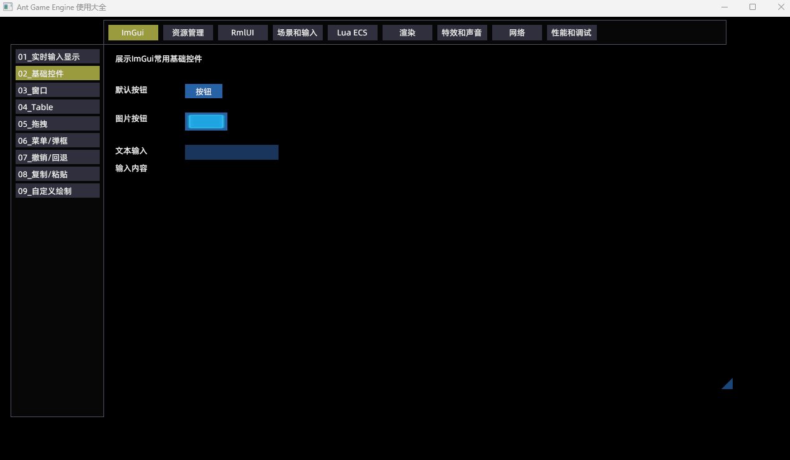

# Ant Game Engine 使用大全
本项目试图给[Ant Engine](https://github.com/ejoy/ant)的每个功能点都加一个示例，以便大家学习，以及需要时可以直接Ctrl+C，Ctrl+V。

**欢迎有兴趣的朋友加入进来一起完善~**


#### 目前实现的功能点有:
1. imgui实时输入显示 (实际未实现，先效果占位)
2. 第三人称角色操控 (实际未实现，先效果占位)


## 如何运行
将工程克隆到引擎根目录，然后执行run.bat
```
git clone https://github.com/constly/ant_demo.git
cd ant_demo
run.bat
```


## 如何注册一个功能示例
```
local ecs = ...
local system = ecs.system "system_name"
local mgr = require "data_mgr"
local id = mgr.register(system, mgr.type_imgui, "02_基础控件", "展示基础控件")

-- 当进入示例时（可能需要执行一些初始化）
function system:on_entry()
end

-- 当离开示例时（可能需要执行清理操作）
function system:on_leave()
end

-- 如果能在外层控制不执行system的回调就好了
-- 自己实现一个tick? (但可能调用时机不合适)
function system:data_changed()
    if id ~= mgr.get_current_id() then return end 

    -- 具体示例代码写这里
end
```