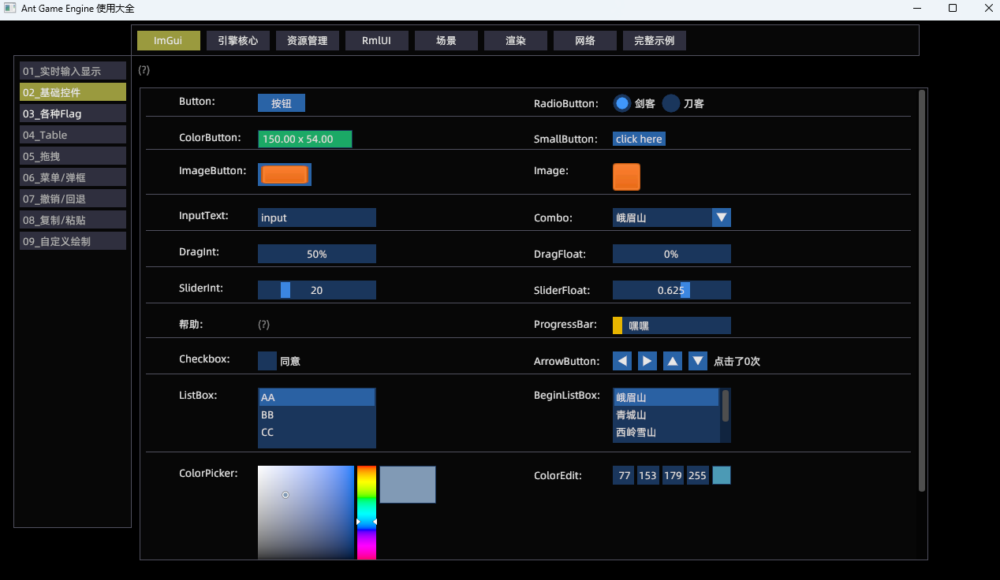

# Ant Game Engine 使用大全
本项目试图帮助我以及很多与我一样学习能力不出众的开发者尽快上手[Ant Game Engine](https://github.com/ejoy/ant)，具体指导方针如下:
```
* 尽可能给每一个功能点都加上示例代码
* 尽可能覆盖游戏开发的方方面面，比如编辑器，UI，渲染，联机，调试，优化，资源管理，对接Steam等等
* 尽可能多写注释讲明原理
* 尽量封装+模块化，以便需要时直接Ctrl+C, Ctrl+V
```

**欢迎有兴趣的朋友加入进来一起完善，主界面如下:**


#### 所有示例如下 （划线的表示尚未实现）
* ~~ImGui - 01_实时输入显示~~
* ImGui - 02_基础控件(进行中)
* ~~ImGui - 03_窗口~~
* ~~ImGui - 04_Table~~
* ~~ImGui - 05_拖拽~~
* ~~ImGui - 06_菜单/弹框~~
* ~~ImGui - 07_撤销/回退~~
* ~~ImGui - 08_复制/粘贴~~
* ~~ImGui - 09_自定义绘制~~
* ~~资源管理 - 01_通过vfs加载资源~~
* ~~资源管理 - 02_自定义文件读取~~
* ~~RmlUI - 01_基础控件~~
* ~~RmlUI - 02_列表和弹框~~
* ~~RmlUI - 03_UI播放动画~~
* ~~RmlUI - 04_UI播放特效~~
* ~~RmlUI - 05_UI中显示RT~~
* ~~渲染 - 01_LOD~~
* ~~渲染 - 02_光影/迷雾~~
* ~~渲染 - 03_森林/草原~~
* ~~渲染 - 04_河流/瀑布~~
* ~~渲染 - 05_下雪和脚印~~
* ~~渲染 - 06_下雨和水面涟漪~~
* ~~渲染 - 07_RenderTexture~~
* ~~渲染 - 08_卡通渲染~~
* ~~渲染 - 09_画质设置~~
* 其他若干示例待规划


## 如何运行
将工程克隆到引擎根目录，然后执行run.bat，注意: 默认使用的release引擎
```
git clone https://github.com/constly/ant_demo.git
cd ant_demo
run.bat 
```


## 如何注册一个功能示例
```
local ecs = ...
local system = ecs.system "system_name"
local mgr = require "data_mgr"
local id = mgr.register(system, mgr.type_imgui, "02_基础控件", "展示基础控件")

-- 当进入示例时（可能需要执行一些初始化）
function system:on_entry()
end

-- 当离开示例时（可能需要执行清理操作）
function system:on_leave()
end

-- 如果能在外层控制不执行system的回调就好了
-- 自己实现一个tick? (但可能调用时机不合适)
function system:data_changed()
    if id ~= mgr.get_current_id() then return end 

    -- 具体示例代码写这里
end
```